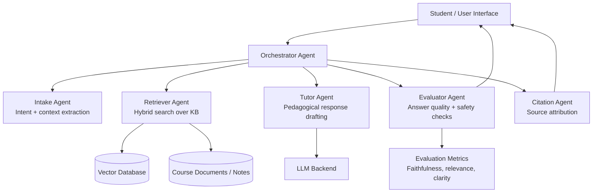

# AlSchool — Multi-Agent RAG Educational Platform


AlSchool is a multi-agent retrieval-augmented educational platform designed to deliver grounded, personalized learning support with auditable reasoning traces.

## What is this

AlSchool is an AI education platform that combines multiple specialized agents with a RAG pipeline to answer learner questions using trusted course knowledge. It exists to improve answer quality, reduce hallucinations, and make educational AI outputs more explainable.

## Why it exists

General LLM chat experiences are often not enough for coursework support because they lack domain grounding, consistency checks, and pedagogical adaptation. AlSchool addresses this by orchestrating role-specific agents over a curated knowledge base.

## Architecture / Stack



**Planned stack:** Python, retrieval pipeline, embeddings, vector database, LLM orchestration, evaluation layer.

## Installation

This repository currently publishes architecture and design artifacts while implementation is being prepared for public release.

```bash
git clone https://github.com/fbenkhelifa/alschool.git
cd alschool
```

## Usage

### Current usage

- Review architecture and design documents in `docs/`
- Track roadmap and implementation milestones

### Planned runtime usage (post code release)

- User submits educational question
- Agents retrieve grounded context, generate answer, evaluate quality, and return cited response

## Project structure

```text
alschool/
├── README.md
├── .gitignore
├── LICENSE
└── docs/
    └── DESIGN_BRIEF.md
```

## Limitations

- Public source code is not yet published.
- No deployable runtime in this repository at this stage.
- Benchmarks and evaluation dashboards will be published with implementation.

## Roadmap

1. Publish baseline orchestration pipeline and retrieval layer.
2. Add tutor/evaluator/citation agents with evaluation harness.
3. Add curated educational dataset preparation workflow.
4. Release reproducible local deployment profile.
5. Publish benchmark results and ablation notes.

## Publication note

Source code will be published post-graduation (June 2026). Architecture and design documentation are available in this repository.

## License

Licensed under MIT. See [`LICENSE`](./LICENSE).
